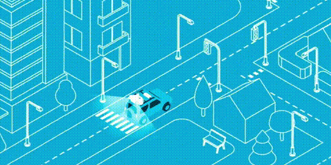
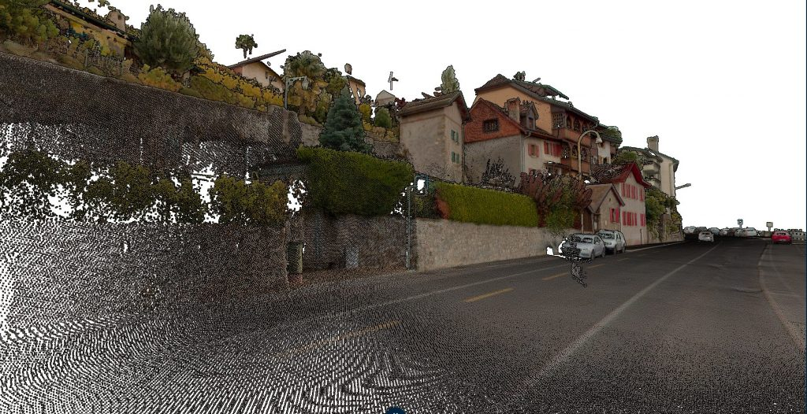
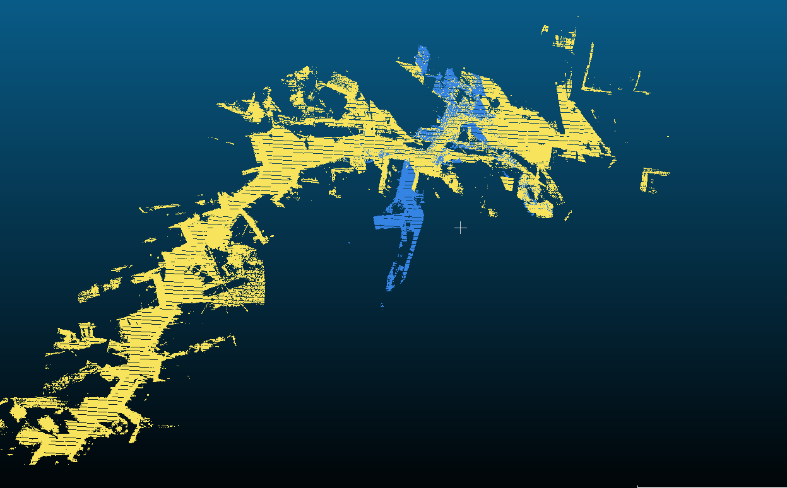

#  Mobile 3D Vision: LiDAR Assisted Car Navigation and Mapping using Deep Learning on Point Clouds

Semester project developed in the ENAC laboratory at epfl. Developed with data from the orbis 360 company.

| **Developpé sur**                                              |
| ------------------------------------------------------------ |
[Ubuntu-20.04](https://img.shields.io/badge/Ubuntu-20.04-blue.svg)

> Description du projet [ici](https://sites.google.com/view/portfoliovictorianguyen/mobile-3d-vision-lidar-assisted-car-navigation-and-mapping-using-deep-lea?authuser=0)

## :key: Mot clés

LiDAR, 3D Correspondences, Deep Learning, Point Cloud, Mobile Laser Scanning, Navigation, Trajectory Estimation

### :star: Syllabus :

In Mobile Laser Scanning (MLS), LiDAR scanners are mounted on cars to scan along roads with various applications such as road inspections, mapping or navigation. The accuracy of point clouds is a key requirement of such measurement campaigns, of which a prerequisite is the careful modeling of the trajectory and its accurate estimation. This is challenging to obtain in practice because loss of GNSS signal or degradation of its quality are common events when scanning from the road.

In this project, you will contribute on improving a real scanning system operated by a Swiss company, orbis360. The project will focus on adapting a deep learning methodology developed in our lab and able to recognize correspondences (i.e. recognizable points scanned multiple times in the point cloud). The end goal is to improve the robustness of the trajectory estimation and point cloud generation pipeline when GNSS signal degradation occurs, allowing for more accurate 3D digitization of scanned areas.

## :gear: First step : extraction of overlapping areas

The aim is to be able to extract correspondences and carry out a matching between the 2. Here, the difficulty is that

- the 2 clouds are very dense (~10M points)
- the overlap area is small (around 50 X 50 X 50) : see image below. The point cloud are partially overlapping.

__Method__

- Compute the __bounding box__ of the concatenation of the 2 point clouds
- Discretize the bounding box into small cubes of size _a_
- For each cube, we compute a booean : True of it has points from both clouds, False otherwise
- We keep the cubes that are True 
- We extract 2 subsets of points from the 2 clouds that are inside the cubes
- In order no to lose to much information, we create a second bounding box of the 2 subsets and we keep the points that are inside this second bounding box

__Result__

Insert images

## :gear: Second step : Pre processing and division into chunks

We then divide the point clouds into chunks of size _b_ and we preprocess them. The preprocessing consists in dividing the point cloud into chunks : in order to use the metrics, we must be sure that they are aligned.

==> ICP